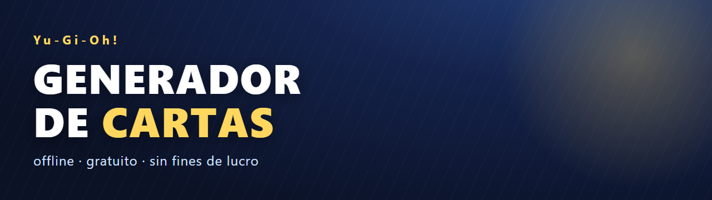
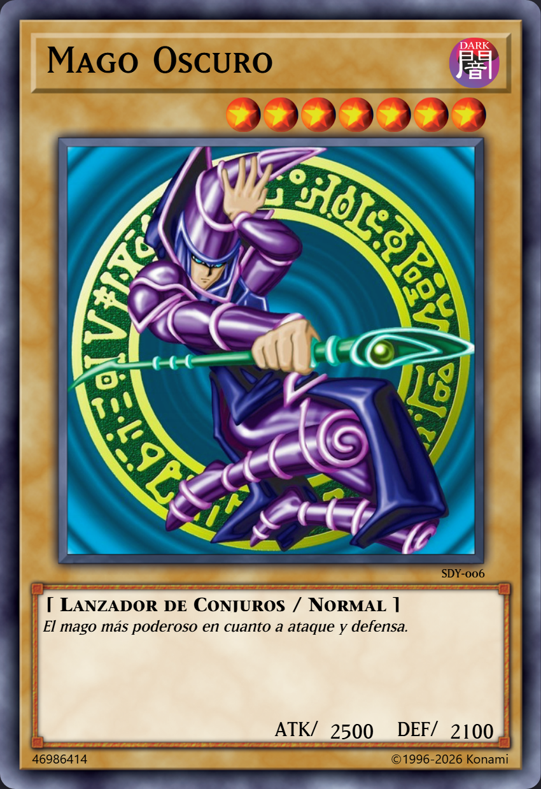

<p align="center">
  
</p>

# 🃏 Generador de Cartas Yu-Gi-Oh!

[](https://github.com/carloslatta/generador-de-cartas/stargazers)
[](https://github.com/carloslatta/generador-de-cartas/forks)
[](https://carloslatta.github.io/generador-de-cartas/)
[](https://nodejs.org)
[](https://github.com/carloslatta/generador-de-cartas)

Generador **offline**, **gratuito** y **sin fines de lucro** para armar cartas y decks de Yu-Gi-Oh!, hecho para la comunidad. Todo corre en tu propia máquina con un servidor Node local.

## 🎴 Sobre el proyecto

Este proyecto nació de una necesidad muy concreta: quería generar mis propias cartas de Yu-Gi-Oh! para uso recreativo y personal. Al buscar, me topé con varios repositorios y generadores que estaban sin terminar o abandonados. En lugar de renunciar a la idea, decidí completar uno por mi cuenta, afinarlo hasta que funcionara bien y dejarlo abierto para cualquiera que tenga el mismo interés.

La idea es simple: una herramienta gratuita, offline y sin fines de lucro para que cualquier fan pueda armar sus propias cartas, con datos reales (nombre, texto, estadísticas), el marco correcto y exportación en alta resolución para imprimir y jugar.

## 🚀 Demo en vivo

Puedes probar el editor de cartas sin instalar nada:

👉 **https://carloslatta.github.io/generador-de-cartas/**

<p align="center">
  
</p>

> Nota: la demo online permite diseñar la carta completa. La búsqueda de cartas en línea (índice + YGOPRODeck/Yugipedia) y el guardado de PNG requieren el servidor local (`node server.js`).

> **Aviso legal:** Este proyecto es un trabajo de fans, **sin fines de lucro**, con fines de entretenimiento. No está **afiliado, patrocinado ni respaldado por Konami Digital Entertainment**. `Yu-Gi-Oh!` y todos los elementos relacionados (cartas, nombres, textos, imágenes y marcas) pertenecen a sus respectivos propietarios. La aplicación es **gratuita** y las donaciones son **voluntarias**. Las imágenes y los datos de las cartas se obtienen de **fuentes externas** (YGOPRODeck, Yugipedia, etc.) y este programa **no reclama propiedad** sobre dicho contenido; todo lo generado es solo para uso personal y de colección.

## ⚙️ Requisitos

- Node.js (para el servidor y los tests)
- Google Chrome instalado en `C:/Program Files/Google/Chrome/Application/chrome.exe` (para los tests de navegador)

## ▶️ Cómo arrancar

```bash
node server.js
```

Abrir en el navegador:

- **Armador de cartas**: `http://localhost:8080/armar.html`
- **Generador de decks**: `http://localhost:8080/deck.html`

El servidor expone `http://localhost:8080/api?url=...` como proxy para YGOPRODeck y Yugipedia (indispensable para buscar y bajar imágenes).

## ✅ Qué funciona (verificado)

### Búsqueda unificada (`js/buscador.js`)

Usado por `armar.html` y `deck.html`. El **índice local manda**: `cards.json` trae por carta `id`, `name_en`, `name_es`, `type`, `frameType`, `race`, `attribute`, `level`, `atk`, `def`, `link`, `linkmarkers`, `scale`, `archetype` e `img`. Con eso la plantilla se arma **sin ninguna petición de red**.

Pipeta de fuentes en orden:

1. **Índice local** `cards.json` (14.568 cartas, 12.357 con nombre ES, ~4,2 MB; `build-cards-index.js` lo regenera) → carta completa al instante.
2. **Yugipedia** (solo el texto de efecto en español) → se pide en segundo plano y se parchea la carta ya montada.
3. **YGOPRODeck** (vía proxy) → solo si el índice no cubre la carta, o para el texto en inglés cuando Yugipedia no responde.

API pública: `window.Buscador.buscar(consulta)` → array de cartas `{nombre (ES), nombreEN, atk, def, nivel, tipo, habilidad, texto, password, arte, frameType, atributo, escala, linkmarkers, archetype}`.

- **Passcode**: teclea el ID de 8 dígitos (p. ej. `46986414`) y la carta se resuelve por `id`, sin buscar por nombre ni llamar a la API.
- **Estadísticas variables**: la API usa `-1` para ATK/DEF que dependen de la partida; se muestran como **`?`** (y los Link no muestran DEF).
- Latencia medida en `armar.html`: ~0,35 s de teclear a carta visible por passcode y ~0,5 s por nombre (antes: hasta 3,7 s y 10 peticiones).
- `Buscador._estadoIndice()` → `{listo, n}` (indica si el índice local cargó).
- Errores de red nunca rompen: cada fuente tiene fallback a la siguiente.

### Regenerar el índice (`build-cards-index.js`)

```bash
# Desde el volcado local que ya tienes descargado (no hace red):
node build-cards-index.js "C:\Users\RYZEN\Downloads\cardinfo.php"

# O desde la API pública (modo original, sin User-Agent):
node build-cards-index.js
```

El volcado se puede renombrar a `.json`: es el JSON de `cardinfo.php`, no código PHP. El script **no guarda `desc`** (el texto de efecto son 8,3 MB y solo existe en inglés): lo sigue trayendo la red en runtime. El `name_es` sale del índice de nombres de `db.ygoresources.com` (EN↔ES unidos por id interno); con `--offline` se reutiliza el `name_es` del `cards.json` anterior y no se hace ninguna petición.


### Armador de cartas (`armar.html`, `js/armar.js`)

- Búsqueda por texto: teclea un nombre (EN o ES) y **auto-arma** la carta con datos del Buscador.
  - EN (o ES con match exacto en índice): arma directo con arte YGOPRODECK.
  - ES sin match: cae al flujo viejo (wikitexto de Yugipedia).
  - Borrar el campo vuelve al modo manual.
- Layouts según `frameType`: monstruo normal/efecto, xyz, link, synchro, fusion, ritual, pendulum, spell, trampa, token.
- Datos automáticos: nombre (ES), atributo, nivel/rank/link, atk/def, tipos, habilidades, texto ES, password, arte (imagen YGOPRODECK o máscara con la carta).
- Edición manual de todos los campos si hace falta (select de layouts `auto` por defecto).
- **Guardar PNG**: botón "Guardar PNG" → escriba nombre → `/cartas/<nombre>.png` vía `POST /guardar` (soporta subcarpetas con `carpeta`).
- `window.CARD` expone la carta activa; `obtenerTextoES` cachea traducciones.

### Generador de decks (`deck.html`, `js/deck.js`)

- **Autocomplete** al teclear: sugiere cartas con nombre ES + (EN) usando el Buscador.
- Búsqueda por texto:
  - **Nombre de carta** (ES o EN) → genera un deck con esa carta (y sus arquetipos relacionados si `archetype` disponible), con thumbnails y nombres en español.
  - **Deck publicado** → busca `cardinfo.php`/deck search y muestra resultados con thumbnails.
- Banlist: TCG / OCG / Goat Format.
- Exportar: **Generar 40 cartas** (usa el armador por detrás) y **Exportar ZIP**.
- `renderDeckPreview`: usa la CartaNormalizada del Buscador (nombre ES, texto, arte) cuando está en caché; si no, el camino viejo (`cardinfo.php?id` + `obtenerEspanol`) intacto.

## 🧪 Browser tests (`tests/`)

Requieren el servidor corriendo (`node server.js`) y Chrome.

```bash
cd tests
npm install            # primera vez (puppeteer-core)
# navegador (E2E real):
node test-armar.js     # armar.html: EN (índice) y ES con auto-armado
node test-deck.js      # deck.html: autocomplete + búsqueda por carta ES
node test-descarga.js  # busca 5 cartas variadas y las guarda como PNG en cartas/
```

### Test de búsqueda + descarga (ejemplo)

```bash
node test-descarga.js
```

Busca 5 cartas (`Blue Eyes White Dragon` EN, `Dragón Blanco Alternativo de Ojos Azules` ES-effect, `Polimerización` ES-spell, `Call of the Haunted` trap, `Dragón de Ojos Azules Definitivo` ES-fusion), espera el auto-armado con el `password` esperado y guarda el PNG vía el servidor. Resultado esperado: `5 de 5 OK` y 5 PNGs en `cartas/`.

## Tests de módulo (Node, sin navegador)

```bash
node tests/test-buscador.js
node tests/test-indice.js
```

- `test-buscador.js`: carga `mock-dom.js` + `js/buscador.js` y consulta el proxy real (requiere servidor). Corrobora el pipeline índice/YGOPRODeck/Yugipedia y el caso "sin resultados".
- `test-indice.js`: **no necesita servidor** (lee `cards.json` del disco). Corrobora el passcode (`46986414` → Mago Oscuro con nivel/tipo/atributo/atk/def/arte), el `?` de estadística variable (`10678778` Aegaion, `4280258` Apollousa link-4 sin DEF), una mágica (`24094653`), la búsqueda por nombre y el passcode inexistente.


## 🗂️ Estructura de carpetas

```
armar.html          # Armador de cartas
deck.html           # Generador de decks
js/buscador.js      # Búsqueda unificada (núcleo, cacheado, con fallbacks)
js/armar.js         # Lógica del armador
js/deck.js          # Lógica de decks
js/content.js       # Datos de layouts/tipos
js/layouts.js       # Layouts de la carta (CSS)
css/card.css        # Estilos de la carta
server.js           # Servidor local + proxy /api + POST /guardar
cards.json          # Índice local de cartas EN (generado)
build-cards-index.js# Regenera cards.json
mock-dom.js         # Stub de DOM/data para tests de Node
tests/              # Tests (ver arriba)
tasks/              # Plan y todo
SPEC-*.md           # Specs
```

## Nota

`docs/CALIBRACION.md` documenta la calibración del dibujo; `tasks/todo.md` y `plan.md` llevan el plan. `cartas/` contiene PNGs generados (ignorados por git).

## 🤝 Para la comunidad

Este proyecto es un aporte de fans para fans: gratuito, offline y sin fines de lucro.

- Si te sirvió, deja una ⭐ para que llegue a más gente.
- Encontraste un error o falta una carta → abre un [issue](https://github.com/carloslatta/generador-de-cartas/issues).
- ¿Quieres ayudar? Mejoras, layouts nuevos, más traducciones y documentación son bienvenidos vía pull request.

## 📦 Versiones

Ver [CHANGELOG.md](CHANGELOG.md) para el historial de releases. La última versión definitiva es `v1.0.0`.